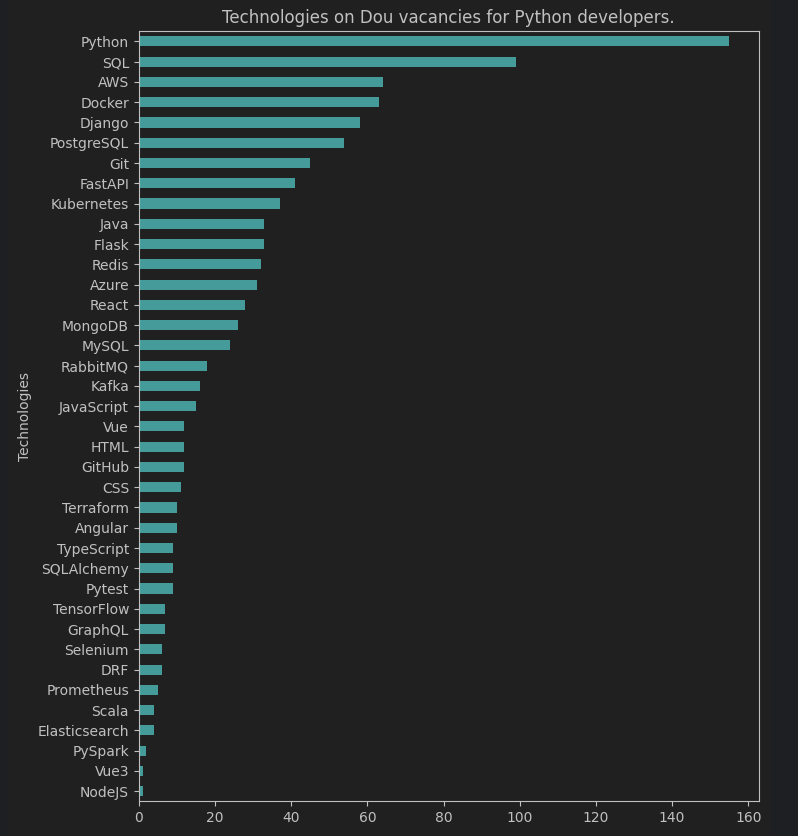

# Scrapping and Data Analysis of vacancies

#### This project is aimed to understand what technologies recruiters expect from python applicants on Dou vacancies, visualising scraped data on chart.

### Installation using GitHub
Python 3.11+ must be already installed:
```
git clone https://github.com/dartomOOv/scrapping-data-analysis.git
python -m venv venv
venv/Scripts/activate
pip install requirements.txt
```
## Running scrapping and analysis
### Scrapping
Run commands:
```
cd webscrapping
scrapy crawl vacancies
```
If you want to update existing vacancies.csv file:
```
scrapy crawl vacancies -o vacancies.csv
```
### Analysis
Open the file `vacancies.ipynb` in `dataanalysis/dou_vacancies_analysis/` and run the given cell. As a result, a bar chart will appear, visualising the number of technologies mention in vacancies 

The result that you may see:



#### Also, you can save current chart by running next cell, which will save it to `dataanalysis/dou_vacancies_analysis/charts/`